# **Plas Penmynydd**
   (pronounced Plas Pen-MUN-idh)
## **Site Overview**

You can find the live site via the following URL - [Plas Penmynydd live webpage](https://amegeddon.github.io/plaspenmynydd/index.html)

Plas Penmynydd is a private home in rural Anglesey, North Wales. it has the most incredible history that its current owner has spent a lifetime restoring and sharing with others. Plas Penmynydd is the ancestral home of the Tudor family and birthplace of Owain Tudor, Grandfather of Henry VII. This website primarily provides a formal platform that lets people know that the house is open to the public during specific periods of the year. This was the main remit of this website, to provide an attractive, proffesional looking site that provided information regarding how to find the house and when to visit. Many people have visited the house over the years through open days advertised locally and through one off chance visits but the owner would like to reach a wider audience. Another aspect that was important was education - regarding the significant history of the house. This is explored in the history page and will no doubt be an ongoing project.

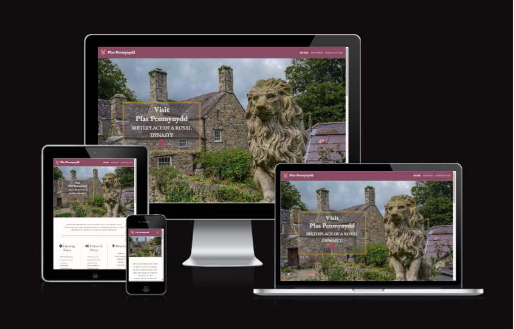
## Table of contents:
1. [**Site Overview**](#site-overview)
1. [**Planning stage**](#planning-stage)
    * [***Target Audiences***](#target-audiences)
    * [***User Stories***](#user-stories)
    * [***Site Aims***](#site-aims)
    * [***How this Will Be Achieved:***](#how-is-this-will-be-achieved)
    * [***Wireframes***](#wireframes)
    * [***Color Scheme***](#color-scheme)
1. [**Current Features Common to all pages**](#current-features-common-to-all-pages)
    * [***Header Element:***](#header-element)
        * [*Title*](#title)
        * [*Logos*](#logos)
        * [*Navigation Bar*](#navigation-bar)
    * [**Hero Images:**](#hero-images)
      * [***Homepage***:](#homepage)
          * [*Hero-Image*](#hero-image)
          * [*Homepage hero image text box*](docs/screenshots/)
          * [*Homepage visitor info DESKTOP VIEW*](docs/screenshots/)
         * [*Homepage visitor info MOBILE VIEW*](docs/screenshots/)
      * [***History page***:](#history-page)
          * [*History link images*](docs/screenshots/)
          * [*History: The life of Owain Tudor*](docs/screenshots/)
          * [*History: The Tudors in North Wales*](docs/screenshots/)
          * [***Contact page:***](#contact-page)
          * [*Contact page*](docs/screenshots/)
          * [*Contact page form*](docs/screenshots/)
          * [***Thankyou page:***](#thankyou-page)
          * [**Footer**](#footer)
      * [**Typography**](#typography)
1. [**Individual Page Content features**](#individual-page-content-features)
    * [**Homepage Content**](#homepage-content)
    * [*Home page blurb*](docs/screenshots/)
    * [**History Page Content**](#history-page-content)
    * [*Zoomed out image of the history page content section*](docs/screenshots/)
    * [**Contact Page Content**](#contact-page-content)
    * [*Contact page mobile view content*](docs/screenshot/)
    * [*Contact page desktop view content*](docs/screenshot/)   
  
* [**During Development Testing**](#during-development-testing)
    * [*Manual Testing*](#manual-testing)
    * [*Bugs and Fixes*](#bugs-and-fixes)
* [**Post Development Testing**](#post-development-testing)
  * [**Validators**](#validators)
      * [*HTML*](#html---httpsvalidatorw3orgnu)
      * [*CSS*](#css---httpsjigsaww3orgcss-validator)
  * [**Lighthouse Scores**](#lighthouse-scores)
      * [*Desktop Version:*](#desktop-version)
      * [*Mobile Version*](#mobile-version)
      * [*Lighthouse Score Feedback From Third Party Testers*](#lighthouse-score-feedback-from-third-party-testers)
  * [**Accessibility**](#accessability)
    
1. [**Future-Enhancements**](#future-enhancements)
1. [**Testing Phase**](#testing-phase)
1. [**Deployment**](#deployment)
1. [**Credits**](#credits)
    * [**Honourable mentions**](#honorable-mentions)
    * [**General reference**](#general-reference)
    * [**Content**](#content)
    * [**Media**](#media)

## **Planning stage**
### **Target Audiences:**
* Users keen to visit Plas Penmynydd
* Users with an interest in Welsh History 
* Users interested in learning more about the Tudor's of North Wales
* Users who have an interest in historic houses 

### **User Stories:**
* As a user, I would like the subject of a website to be immediately clear.
* As a user, I would like to be able to navigate a site intuitively with ease.
* As a user, I would like clear information regarding how to visit Plas Penmynydd.
* As a user, I would like to be presented with visual imagery that gives me an insight into what kind of house Plas Penmynydd is.
* As a user I would like to learn more about the historical significance of Plas Penmynydd
* As a user, I would like to be able to contact Plas Penmynydd with potential queries. 

### **Site Aims:**
* To provide clear information as to how and when to visit Plas Penmynydd.
* To provide an 'Explore Plas Penmynydd' section with strong photographs that gives the user a sense of what Plas Penmynydd is like. 
* To provide the user with information about the house history
* To provide the user with information regarding Owain Tudor and the Tudor's of North Wales
* To provide the user a way to contact the site author for further info, questions, and queries.

### **How Is This Will Be Achieved:**
* The home page will focus primarily on 1. When the house is open 2. Ticket information 3. Where to find the house. There will be a short blurb that highlights the historical link with the Tudors and an explore gallery of visually appealing interior and exterior shots of the house.

* The site will have a history page that will be easily navigated via image links that focus on the house history and the history of the Tudors.

* The site will have a contact page, allowing the user to easily get in touch, should they need too. 

* Through utilising simple design, the site aims to be easily accessible by all. This is something that has been in the forefront of my mind as the demographic of those who visit the house tends to be on the older side. 

### **Wireframes:**
In order to achieve a website that looked as professional as possible it was important to carefully consider the design of the pages. To that end the first stage of this project involved creating wireframes for both mobile and desktop devices. 

* Mobile Wireframes:
    * [Homepage](Docs/wireframes/mobile-home.PNG)
    * [History page](Docs/wireframes/mobile-history.PNG)
    * [Contact page](Docs/wireframes/mobile-contact.PNG)

* Desktop wireframes:
    * [Homepage](Docs/wireframes/homepage-desktop.PNG)
    * [History page](Docs/wireframes/wireframe-history-desktop.PNG)
    * [History page](Docs/wireframes/wireframe-history-desktop1.PNG)
    * [Contact page](Docs/wireframes/wireframe-desktop-history.PNG)
   
There was some deviation from the original wireframes:

* The inclusion of a text box 'Visit Plas Penmynydd: the birthplace of a Royal Dynasty' along with a down icon linking to visiting information. This was a design choice made from concerned that the user might feel lost in the hero image. The addition of this text box serves to improve the users experience of navigating the page.

* The exclusion of social media links in the footer, this was owing to the house owners request not to have to involve themselves in socials.

### **Color Scheme:**
From the beginning I was keen to give the website an elegant look and have opted for simplicity. I began with a body background color of a very light shade of off-white, as I found this more subtle than antique white. I then experimented with red and green, settling on shades that I felt contrasted well with one another and which felt warm and inviting. Ive utilised subtle color transitions on the nav bar and footer by using linear gradients. This was in aid of softening the page and reducing the starkness of large blocks of solid color. 
 * [Color Palette-red](Docs/screenshots/color1.PNG) 
 * [Color Palette - alternative red](Docs/screenshots/color2.PNG) 
 * [Color Palette -contrasting green](Docs/screenshots/color3.PNG) 
 * [Color Palette - alternative contrasting green](Docs/screenshots/color4.PNG) 
 * [Color Palette - offwhite background color of pages](Docs/screenshots/colorbg.PNG) 
 * [Color Palette - white text color ](Docs/screenshots/colortext1.PNG) 
 * [Color Palette- alternative white text color](Docs/screenshots/colortext2.PNG) 
 * [Color Palette - grey text color](Docs/screenshots/color1.PNG) 
 * [Color Palette- alternative white text color](Docs/screenshots/colortext2.PNG) 

## **Current Features Common to all pages**
###  **Header Element**
I choose not to use a header and instead opted for a simple nav bar at the top of the page. 

#### *Title:*
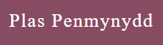

* The title of the page is Plas Penmynydd, this being the House name. Plas translates from Welsh to House and Penmynydd translates to hill, so essentially house on the hill. 
* The title also serves as a navigation link to the homepage as we have come to expect as internet users. 

#### *Logos:*
* The chosen logo is the Tudor shield, it is easily recognisable as such and feels apt given the Tudor lineage linked to the house. It adds visual appeal and draws the eye to the website brand name: Plas Penmynydd. 

    * Whilst the nav-links collapse on mobile device I have decided to keep the logo alongside of Plas Penmynydd owing to the fact that it looked better with, than without. 

        

    * Desktop logo adjusts in size depending on screen size as it utilises bootstrap 5 responsiveness. 

        

#### *Navigation Bar:*
* The navigation bar appears on all three pages at the top of the page where it is fixed with the bootstrap class sticky-top. There were other options that could have been explore for example having Plas Penmynydd in a header above the nav bar, however, I really wanted to keep the site simple and straightforward. In addition, I wanted the user's focus to be drawn to the hero image. 
* The navigation bar contains links to the homepage (through the plas penmynydd navbrand), History and contact us pages. Its sticky position has the effect that the user can easily navigate between the pages at any time. 
* To ease user navigation there is an active class that shows the user which page they are currently on - the below image shows the active home page which appears white, whilst the other pages appear pink. This is subtle, but hopefully not to subtle. 
* When the navlinks are hovered over the text of the navlink turns a contrasting green color and is underlined.

***
### **Homepage**:
#### *Hero-Image:*
The hero image shows a side view of Plas Penmynydd with a lion statue in the foreground. It’s an interesting image that I hope serves to grab the users attention. The hero image is large and intended to be the first thing the user sees. Later in the project I made the design decision to provide a text box that directed the user to look down the page and find the visitor information. 
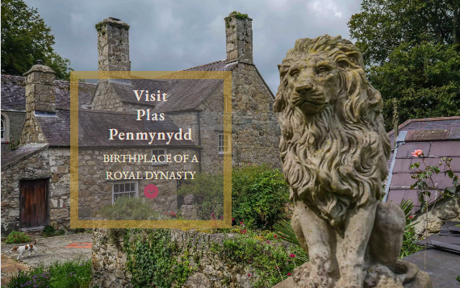
#### *Visit Plas Penmynydd text box*
Essentially this exists to direct the users focus down the page and onto the visiting information section. However, it became a good way of selling the Plas and drawing attention to what makes it so historically interesting - namely its link with the Tudor dynasty. Through using a font awesome downward icon, I have embedded an anchor link that if clicked takes you to the visiting information section of the homepage. On a mobile device this text box disapears as its not needed given the scaling down of the hero image. 

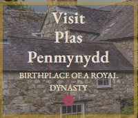

#### *Visitor information section*
This is organised into three columns: Opening hours, Ticket prices and directions. Again, the focus was on being as simple as possible. Fontawesome icons serve to draw focus and add interest. In the directions column there is an iframe containing googlemap directions for the Plas. Using bootstrap made the organisation of these columns straightforward. particularly when it came to making them responsive. On mobile devices the three columns are reduced to one so as the content of each heading takes up the entire screen width.
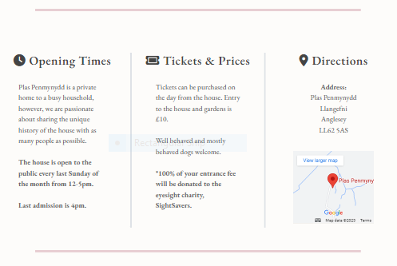
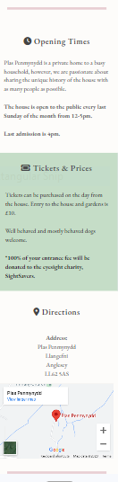

#### *Explore Plas Penmynydd section*
This is the final section of the homepage. This comprises of a gallery of photos of the Plas with short descriptions underneath. To make the captions more visible against the photos I have used some css customisations - by using a black background with an opacity of 0.1 I have given the white text a bit more contrast which has aided the readability of the text. 

### **History page**:
#### *Image links*
This history page is very heavy on text information with six separate headings. These sections have been arranged so as they can be navigated to through the use of this image menu. Using a text overlay upon hovering over the image keeps the image simple and uncluttered. Users are good at recognising images as navigational links and the use of the text overlay serves to highlight that these are links to the different headings within the page. The six sections are: 1. The life of Owain Tudor 2. Tudors in North Wales 3. Penmynydd Church 4. The history of Plas Penmynydd 5. Plas Penmynydd restoration process 6. Historic features of the house. I will focus on the first two in this readme file. Viewed on a mobile device this image menu collapses a little to two image links per row, rather than the three that we see on the desktop.

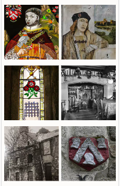

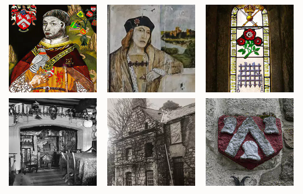

#### *History section features:*
To structure these sections uniformly bootstrap containers have been used. Text and images appears on tablets and desktop devices as occupying 8 columns. Whilst quote boxes with interesting facts occupies the final 4. On mobile and small screen sizes this is all collapsed down to one column that takes up the entire screen width. This is then repeated through all six sections of history. The only departure from this is in the Historical features of the house and Restoration of the house sections, here carousels are used in place of an image as there are several images showing various shields and inscriptions. 

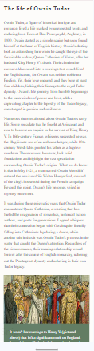

### **Contact us page:**
#### *Background-Image:*
This image is taken in the study of Plas Penmynydd and features the library bookcases. The intention was to provide a backdrop that was visually stimulating but did not distract too much from the contact form which floats transparently over the image. 

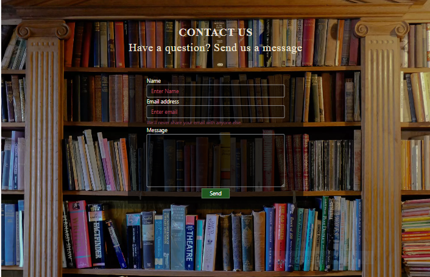

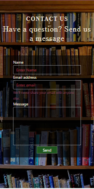

#### *Contact page: contact form*
The form requires that all inputs are fulfilled in order to send and uses placeholders to direct the user. It was coded using bootstrap 5 and customised to be visually appealing against the background image. The submit button is styled using the green that is used throughout the project. The headings too use the same white and off white to give a cohesive feel to the webpages. 

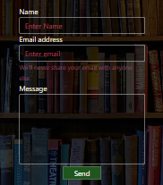

### **Thankyou page:**
This page is stylized in the same way as the contact page and has the simple message of 'Thankyou, we will be in touch shortly'. When the contact form is submitted the user is sent to this page. 

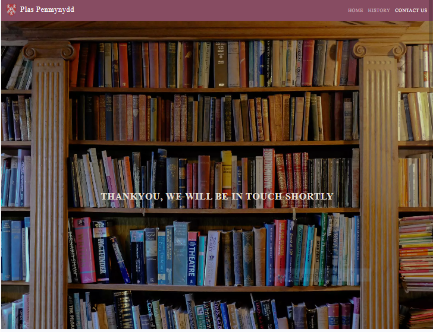

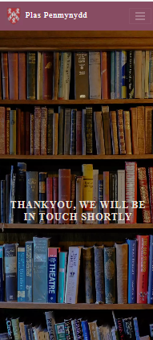

## **Footer**
* The footer is simple and unfussy. It features Jasper Tudor's (son of Owain Tudor) coat of arms which is set against a green background that has a transition gradient with a lighter green to soften the large block of color. Without social media links the footer has become more of a stylistic element that one with a practical use. however, it does serve to give a balance to the pages. 

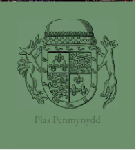

## **Typography**
* In this project just one font-family was used:
  *  EB Garamond with a fallback font of serif
* This font was chosen as it has the elegant appearance that was appropriate for a historic house website. 
* This font was sourced from Google fonts, as stated in the credits. Whilst I did import another font, Roboto, this font did not compliment the project in the way I hoped. 

## **Individual Page Content features**
### **Homepage Content:**

* The content of this page fulfils the first two aims of this website. 1. it provides clear information as to how and when to visit Plas Penmynydd with directions provided via address and googlemap link. 2. The 'Explore Plas Penmynydd' image carousel gives a strong impression of what the house looks like - which is important because not everyone will be able to visit who has an interest in its history. The homepage with its short blurb beneath the hero image also clearly lays out the historical significance of the house and leads to a better user understanding - e.g. this is what the house looks like, this is why its historically unique and this is how you can visit. It clearly leads the user in a way that is informative and concise.

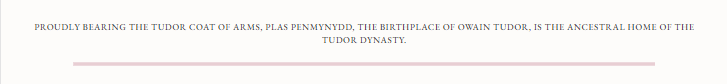

### **History Page Content:**
* Includes six sections, each section has a unique anchor that allows the user to pick and choose which section to read from the image menu. To meet the aim of educating the user about the unique history of the house it was necessary to provide a comprehensive history section. Owain Tudor is not a well-known figure amongst the Tudors and so it’s necessary to give the user more information about his life in a way that is engaging and adds to a user’s appreciation of Plas Penmynydd. To this end paragraphs are kept as short as possible. Text is broken up through the use of images and figcaptions that provide a little visual stimulation and pertain to the subject being discussed. 
* The six sections each cover an element that adds to and brings life into the history of house.
* All images are taken by myself with the exception of the image in the 'Life of Owain Tudor' and the tudor coat of arms - these image come from adobe stock images and have been properly licensed for use. 
* Images are wrapped in a figure element and given a figcaption to detail who the image portrays.
* Blockquotes are used to contain interesting facts for each section, and these are given a subtle background color to help them stand out from the page. These too are wrapped in a figure element.

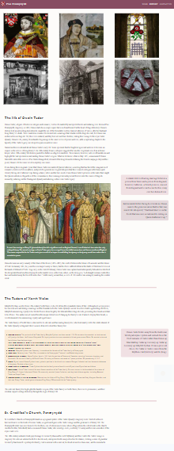

### **Contact Us Page Content: **

* Offers a way for the user to contact me as the site author should they have any questions. This fulfils the final site aim. 
* With minimal features and complexity to add to useability and a better user experience, this page consists of a h2 and h4 heading elements with a simple bootstrap form beneath and to the centre of the page. This form has just three inputs - name, email, and message. Followed by a send button. This has then been customised through css to give it a consistency in terms of color and font style with the rest of the website.
* On mobile view this form content takes up much more of the viewing screen and this is to optimise user experience, as it makes the form far more readable and easier to use. 

 

## **Future-Enhancements**

* The future intention of the site would be to incorporate a 3d house tour. The demographic who are most interested in the house are older people who aren’t always mobile enough to visit historic homes. This would be a great way to make the house and its fascinating history more accessible. Additionally, this is a private home and so public openings are limited to one day a week during the summer months - so again, this provides another avenue to provide a more virtual experience of the house. It’s a massive hurdle for charities like the National Trust wheelchair accessible and this is also a case for private homes, with a grade I listed building making such alterations just is not possible. Providing this virtual tour serves to include a demographic who I suspect would not be able to visit the house in person. 

* It has been the house owners’ lifetimes work to restore the house. He has so much knowledge about the intricate history of the house that he would like to share. Future enhancements will be history sections added to and rewritten to incorporate his immense knowledge and really to preserve his legacy as well as the house.

* I would also make the contact form fully functional with a post request. 

* Something that I have been a little unhappy with is the sizing of photos on mobile screen. I made the mistake of sizing all my images in a 16:9 ratio. This looks great on desktop but not so great on mobile. Using aspect-ratio in css I attempted to change the aspect ratio on images with a mobile media query. This worked to an extent but as the original image was in a 16:9 format it was stretching the image and it just did not look right. So what I will do is to try the reverse, have images that are 4:3 and then apply an aspect-ratio media query for larger screens. I need to further investigate this and find out what is the most adaptable image size to work with. Next time I think more planning is needed here. Perhaps using a width of 2500px and using height to crop to the correct aspect ratio would be a solution here. 

## **Testing Phase**

## **During Development Testing**
1. Manual testing was carried out during the development process through the use of Chromes developer tools to ensure that the pages were responsive and correctly scaling on each screen size. This was done through using the Live Server v5.7.9 extension in VSCode. 

1. Through using W3C Markup Validation to validate HTML and W3C CSS validation to validate CSS regularly through the project’s development helped ensure that there were no coding errors as I progressed through the build. 

### ***Manual Testing:***
* A lot of the testing here was in the form of making sure nav links worked by clicking them and ensuring they led to the right destination. Carousels were left running in order to consider what the best transition time between image changes would be best and indicator buttons clicked to ensure that images moved on to the next and previous slide. The form on the contact page was tested by trying to submit without having filled out required information. It was then submitted to ensure that the thankyou.html page was operating correctly. Additionally, I have tested the site on the following browsers:

  1. Chrome
  2. safari  
  3. Internet explorer 
  4. Edge

  The website appeared fine and functional on all browsers. The welcome text box that overlays the hero image appeared significantly smaller on internet explorer and edge but other than this there was nothing of concern.

* Chrome devtools allowed me to view the responsiveness on a range of different devices, I made use of many of them and adjusted where needed through the use of media queries. The biggest issue I found here was on tablet views, in response I created a media query specifically targeting tablet devices to resolve this. 

I also used the devtools to simulate different screen sizes/devices from 320 px up to 4000px in width. 

* The project was shared in the class slack channel asking if fellow students might review the site and report any issues. It was reported that on small mobile screen sizes elements were appearing out of alignment. I hadn’t realised that there were screen sizes smaller than 320px. This was fixed with a media query specifically targeting mobiles with a 260-320 screen size width.

* Additionally, I also tested the site on friends’ mobiles and found no issues or bugs.

### ***Bugs and Fixes:***

Below is a list of problems encountered along the way. More vigorous testing on screen sizes ranging 300px to 1400px revealed the following problems. 

1. * ***Issue Found:*** 
        * On large desktop screens over 1200px the image menu on the history page appeared out of alignment and the images seemed not to fill their containers. 
    * ***Solution Used:*** 
        * Targeted media query at screen sizes of min-width 1280 that increases the image size to a width and height of 400px.
1. * ***Issue Found:*** 
        * Navbar was collapsing on mobile screens, but the 'hamburger' icon was not showing. However, hovering over the area did bring up the drop down nav links. 
    * ***Solution Used:***    
        * Resolved by adding the navbar-dark theme to the navbar class. 
1. * ***Issue Found:*** 
        * In the index.html page it emerged that on mobile devices there was an element causing horizontal scroll. 
    * ***Solution Used***:
        * I had incorrectly used the no gutters class in my parent container. I hadn’t realised that this was not required in Bootstrap5. Removing the class resolved the issue. 
1.    * ***Issue Found:*** 
        * The 'Visit Plas Penmynydd' text box that sits atop the hero image stretched beyond the hero image at tablet screen sizes. 
    * ***Solution Used:*** 
        * Media query for tablet screen sizes and another specifically for the iPad air (this showed as particularly problematic on dev tools) used to move the container, change the width, add padding and amend text size. 
1.  * ***Issue Found:*** 
        * Contact page appeared out of proportion and unbalanced on mobile devices.
    * ***Solution Used:***
        * Targeted media query to move headings from the left to centre and to adjust the size and the position of the contact.
1. * ***Issue Found:***
        * Making the navbar stick to the top of the page using bootstrap sticky-top class meant that when using links to go further down the page, content was being covered up. 
    * ***Solution Used:***
        * This was countered by using scroll-margin-top: 4.5em - this accounted for the width that the nav bar was taking up. 
1. * ***Issue Found:***
        * Horizontal scroll discovered on history.html 
    * ***Solution Used:***
        * H3 headings in the image-menu were too large, reducing the size of these headings remedied the problem.
1. * ***Issue Found:***
        * Overlay used on image-menu in history.html appeared larger than the image it was covering on large and extra-large screen sizes. 
    * ***Solution Used:***
        * Overlay sized to the same size as the images it was overlaying. 
1. * ***Issue Found:***
        * Carousel buttons to move onto next and previous image not working on second carousel on history.html page. 
    * ***Solution Used:***
        * This was quite a straightforward fix, googled the problem and learnt that if using multiply carousels on same page that they need different ids on the indicator controls. 
1. * ***Issue Found:***
        * There is an issue with the navbar in the history.html and contact.html pages, this was indicated by lighthouse analytics which found problems with the contrast between foreground and background on these elements. Closer inspection revealed that the navbrand was taking up more space on these pages and appeared larger despite having the same font-size and css styling as the index.html. 
    * ***Solution Used:***
        * Whilst I've looked at whether the active class in the navbar is causing this issue and thoroughly made used of devtools, this remains an ongoing issue.                 
        
## **Post Development Testing**
### **Validators**
#### ***HTML*** - https://validator.w3.org/nu/

* ***Issue Found:***
    * In history.html the validator was giving error messages for the image menu links, informing that no closing </a> could be found. 
* ***Solution Used:***
    * After a little trial and error, I realised that I had wrongly wrapped the entire div container with the anchor link. Using them solely around the overlay text remedied this issue. 
    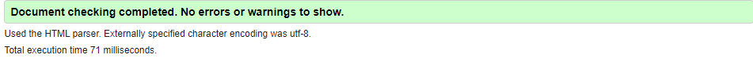

#### ***CSS*** - https://jigsaw.w3.org/css-validator/

* All pages tested, no issues found via URL or file upload.\

### **Lighthouse Scores**
### **Test conditions**
* Tests were run whilst browser page was in incognito mode
* I ran the tests for both mobile and desktop. 

#### ***Desktop Version:***

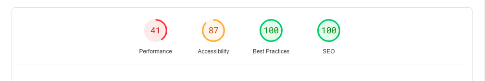 
 

**There were several actions required to get to this score:**

1. The main issue were the number of images on the index.html page, the size of these images both in pixel width and physical size was causing a very slow loading of the page. Through resizing all the images, compressing them and then converting them to webp files reduced the weight of this project from 80mb to 11.3mb. I have included the screenshot of the index page only as the history and contact page being significantly smaller in payload havent been such an issue and both are consistently scoring 100, 95, 100, 100.

1. The accessibility score was considerably easier to improve as I had made some silly errors. Some images were missing alts and there was not sufficient contrast on foreground and background elements. It has remained at 95 as I liked the softened look of the text below the footer. It was at this stage of development that I noticed that the nav links were slightly different on the history and contact pages. Lighthouse was indicating that on just these pages there was a contrast issue, which did not exist on the index page. Having looked more closely with devtools I have noticed that the navbrand appears larger on these two pages. Having thoroughly investigated this I cannot fathom why this is, it’s the same font size and no css is being applied to this navbar in a way that would impact these two pages along and yet the container that the navbrand sits in is larger. This remains a mystery to me and I will add this as an ongoing problem in my bugs and fixes section. In order to achieve a better score here it was necessary for me to change the h5 headings in the carousel to h4 in order to be sequential in my heading use. However, lighthouse continually picks up just one image from this carousel that it is unhappy with the use of the h4 heading element. 

#### ***Mobile Version:***

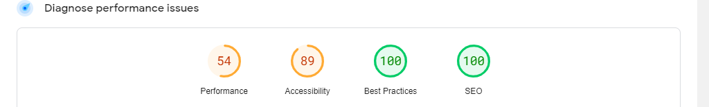

1. Much like the desktop page the major issues lay in that index page and the explore feature carousel. Whilst resizing, compressing, and converting all img files to webp pushed the performance score up into the 90s on desktop, on mobile device this only resulted in a score of 82. I suspect if I were to remove this carousel of 11 images it would increase but given that this explore feature was part of my ux design I thought it important enough to keep it. If the performance was below 80 I could have considered using a spinner but 80's not to bad, but definitely something I will be looking at improving in the future. 

2. The accessibility score was increased by putting a green background to the ticket information and changing the font color. However, the score here remains at 95 owing to the use of that softer look on the footer text. 

## **Deployment**
I deployed the page on GitHub pages via the following procedure: -

1. From the project's [repository](https://github.com/amegeddon/plaspenmynydd), go to the **Settings** tab.
2. From the left-hand menu, select the **Pages** tab.
3. Under the **Source** section, select the **Main** branch from the drop-down menu and click **Save**.
4. A message will be displayed to indicate a successful deployment to GitHub pages and provide the live link.

## **Credits**
* The code used to provide transition effect on the Homepage Carousel was found through the slack community channel, where someone had previously struggled with the same issue I was having. I was able to take some of the code provided there and incorporate it into my project. 
* The overlay effect on the history page images eluded me for the longest time, I am so grateful to the code institute tutor who broke down what it was I was trying to achieve and provided a clear way forward. 
* Bootstrap 5 - I have made use of bootstrap as much as possible, from its preloaded code for carousels and forms to classes for positioning. It makes responsive building so much easier. 

### **Acknowledgements**
I would like to thank my fellow students at code institutes June Wales intake, a lovely group of people who keep the momentum going even when things look a bit daunting. A special mention goes to:

* [Richard Wells](https://github.com/D0nni387) - Code Institute Mentor who has been so encouraging and generous with his time and expertise. 

### **Media:**

* Images requiring compression were done using - [optinizilla](https://imagecompressor.com/) 
* images converted to webp using - [tiny img](https://tiny-img.com/webp/)

